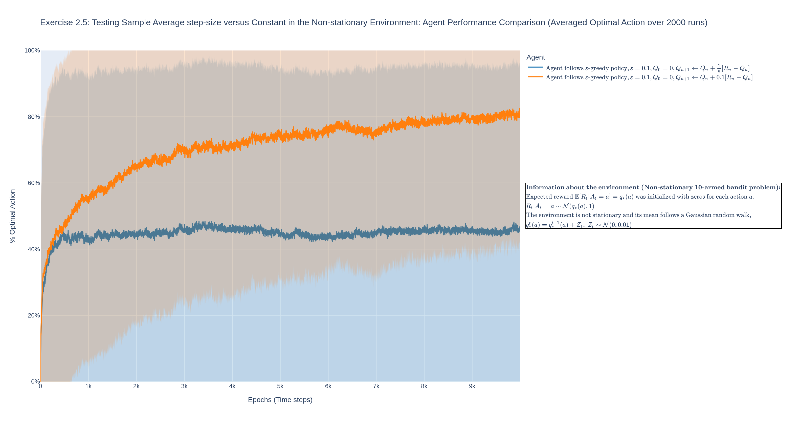
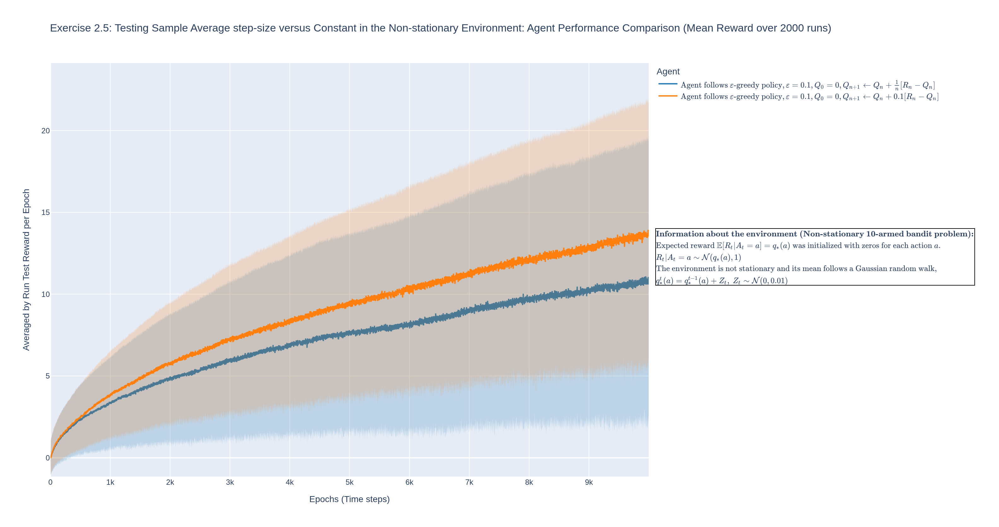

# Modular Bandit Lab

<div align="center">

**A Unified Research Framework for Multi-Armed Bandit Algorithms.**

  

</div>

## 📖 Overview
**Modular Bandit Lab** is a simulation framework designed to rigorously study the 
exploration-exploitation trade-off in Reinforcement Learning.

While many implementations of bandit algorithms exist, they often couple mathematical logic with execution details, making rigorous comparison and extension difficult. This project solves that by treating the simulation as a modular software system.

The goal was not just to reproduce standard results (Sutton & Barto, 2020), but to create a scalable testbed for:
1.  **Algorithmic Stability Analysis:** Testing how agents behave under non-stationary conditions and varying reward distributions.
2.  **Theoretical Verification:** Confirming hypotheses, such as the sensitivity of optimistic initialization to affine reward transformations.
3.  **Reproducibility:** Ensuring that stochastic experiments are seeded, tracked, and strictly separated from visualization logic.

## 🔬 Experimental Insights
Beyond standard benchmarking, this framework has been used to validate nuanced theoretical properties of RL agents:

*   **Affine Invariance & Optimism:** Experiments confirmed that while $\varepsilon$-greedy agents are typically invariant to 
affine transformations of rewards, optimistic initialization breaks this 
property. If the reward scale shifts significantly without adjusting $Q_0$ (the initial value estimate for each action), the "optimism" vanishes or becomes excessive, fundamentally altering exploration behavior.
*   **Regret & Identification:**  In stationary environments, the framework 
    demonstrates that minimizing cumulative regret is intrinsically linked to 
    the speed of optimal arm identification, a relationship visualized by 
    tracking both average rewards and the percentage of time the best action 
    is chosen.


## 🧰 Implemented Algorithms
The framework supports a comprehensive suite of decoupled Agents and Environments.
### Agents
*   **$\varepsilon$-greedy:** Standard exploration strategy with configurable $\varepsilon$ decay.
*   **Optimistic Initialization:** Implemented not as a distinct algorithm, but as a configuration property of value-based agents, allowing it to be applied to any $Q$-learner.
*   **Upper Confidence Bound (UCB):** Deterministic action selection based on uncertainty estimation (Confidence Level $c$).
*   **Gradient Bandit:** Softmax action selection using preference learning ($H_t$) and optional reward baselines.

### Environments
*   **Stationary Gaussian Bandit:** $q_\*(a)$ values are fixed; rewards are drawn from $\mathcal{N}(q_*(a), \sigma^2)$.
*   **Drifting Gaussian Bandit (Non-Stationary):** $q_*(a)$ values follow a random walk (Brownian motion) at every time step, requiring agents to track changing dynamics.


## 🏗️ Architecture: OOP as a Research Enabler
To achieve a unified and maintainable solution for experimentation, the codebase uses Object-Oriented Programming (OOP) not just for structure, but to mirror the mathematical definitions of the problem.

### 1. Mathematical Abstraction & Inheritance
The code structure reflects the theoretical interaction between Agent and Environment, ensuring that experiments test the *algorithm*, not implementation details.

*   **Polymorphism ([`BaseAgent`](agents/base_agent.py)):** All agents ([Gradient](agents/gradient_agent.py), [UCB](agents/ucb_agent.py), [Greedy](agents/epsilon_greedy_agent.py)) share a strict interface. This allows for environment agnosticism, where agents can be swapped seamlessly between Stationary and Drifting environments without code changes.
*   **Shared Logic ([`QValueBasedAgent`](agents/q_value_based_agent.py)):** A specialized intermediate class implements logic shared by both $\varepsilon$-greedy and UCB agents — specifically, the storage of value estimates ($Q_t$), action counts ($N_t$), and optimistic initialization. This ensures that properties like "Optimism" are implemented once as a configurable property and inherited consistently by any value-based learner.
*   **Distinct Architectures ([`GradientAgent`](agents/gradient_agent.py)):** Algorithms that do not rely on value estimation (like Gradient Bandits) inherit directly from `BaseAgent`, accurately reflecting their theoretical distinction from Q-learning methods.

### 2. Separation of Concerns (Mixins)
In scientific computing, plotting code often "pollutes" algorithmic logic. This project uses mixins across the entire codebase to strictly separate core math from visualization.

*   **Core Logic:** Files like [`agents/ucb_agent.py`](agents/ucb_agent.py) or [`environments/drifting_gaussian_bandit.py`](environments/drifting_gaussian_bandit.py) contain *only* the mathematical definitions and update rules.
*   **Visualization:** Dedicated mixins (e.g., [`UCBPlottingMixin`](agents/agents_mixins/ucb_plotting_mixin.py), [`DriftingGaussianBanditMixin`](environments/drifting_gaussian_bandit.py)) handle MathJax rendering, LaTeX description extraction, and Plotly trace styling.
*   **Benefit:** This ensures that the algorithmic core remains pristine and easily auditable by researchers, while still producing publication-quality figures with rich metadata.

## 📊 Visualization Capabilities
The framework includes a custom **Plotly-based** visualization engine that ensures rigorous representation of stochastic behavior through standard deviation bands
and multi-run averaging.
*   **Interactive Dynamics:** Unlike static images, the generated HTML plots allow researchers to zoom, pan, and isolate specific traces to analyze dynamics at specific time steps.
*   **Statistical Shading:** Automatic rendering of standard deviation bands to visualize the variance across runs.
*   **Rich Metadata:** Plots include MathJax-rendered descriptions of the exact environment parameters and agent policies used.





(Above: Generated plots comparing sample-average vs. constant step-size agents 
in a non-stationary environment, replicating Exercise 2.5 (p. 33) from 
*Reinforcement Learning: An Introduction* (2nd ed., 2020) by Richard S. Sutton 
and Andrew G. Barto.)

## 🚀 Usage

### 1. Installation
Clone the repository and install the dependencies:
```bash
git clone https://github.com/perepelart/modular-bandit-lab
cd modular-bandit-lab
pip install -r requirements.txt
```

### 2. Reproduction (Sutton & Barto)
The testbed includes pre-configured experiments to reproduce key figures from *Reinforcement Learning: An Introduction (2nd Edition, 2020)* by Richard S. Sutton and Andrew G. Barto.

**Run the Full Suite:**
```bash
python run.py --experiment "Sutton and Barto All" --verbose
```

**Run Specific Figures/Exercises:**
To run specific figures or exercises, specify one of the following experiment names:
*   `"Exercise 2.5"`: Non-Stationary Environments (Drifting dynamics).
*   `"Figure 2.2"`: $\varepsilon$-greedy performance comparison.
*   `"Figure 2.3"`: Optimistic Initial Values analysis.
*   `"Figure 2.4"`: UCB vs. $\varepsilon$-greedy comparison.
*   `"Figure 2.5"`: Gradient Bandit algorithms (with/without baseline).

**Example:**
```bash
python run.py --experiment "Figure 2.4" --verbose
```

### 3. Custom Experimentation
The framework is designed to be easily extensible. To add a novel experiment (e.g., a High Variance Stress Test), follow this 3-step architectural pattern:

#### Step 1: Define Configuration
Create a file in `configs/` (e.g., `configs/my_stress_test.py`) to define the environment and agents.
```python
# configs/my_stress_test.py
from agents.ucb_agent import UCBAgent
from environments.stationary_gaussian_bandit import StationaryGaussianBandit
from agents.constants import StepSizeMode

# 1. Define Environment (e.g., High Noise)
high_noise_env = {
    'class': StationaryGaussianBandit,
    'params': {'n_arms': 10, 'reward_variance': 10.0} 
}

# 2. Define Agents
my_ucb_agent = {
    'name': "UCB (High Exploration)",
    'class': UCBAgent,
    'params': {
        'exploration_degree': 4, 
        'optimistic_initialization': False,
        'step_size_mode': StepSizeMode.SAMPLE_AVERAGE
    }
}

experiment_config = {
    "environment_prototype": high_noise_env,
    "agent_prototypes": [my_ucb_agent]
}
```

#### Step 2: Implement Logic
Create a script in `experiments/` (e.g., `experiments/stress_test.py`) to handle execution and plotting.
```python
# experiments/stress_test.py
from testbeds.testbed import MultiArmedBanditTestbed
from plotting.learning_curve import LearningCurve
import configs.my_stress_test as config

def run_stress_test(verbose):
    testbed = MultiArmedBanditTestbed(**config.experiment_config)
    testbed_result = testbed.execute(n_runs=1000, t_steps=2000, verbose=verbose)
    
    learning_curve = LearningCurve(testbed_result, plot_name = "Stress Test")
    learning_curve.plot("Mean Reward")
```

#### Step 3: Register in CLI
Add your new case to `run.py` to expose it via the command line.
```python
# run.py
import experiments.stress_test

# ... inside match experiment_type:
    case "My Stress Test":
        experiments.stress_test.run_stress_test(verbose=verbose)
```

**Run your custom experiment:**
```bash
python run.py --experiment "My Stress Test" --verbose
```

#### Example: Custom High Variance Stress Test

To demonstrate this workflow, the repository includes a pre-configured example (`configs/custom_stationary_env_high_variance.py`) that tests UCB vs $\varepsilon$-greedy in an environment with high noise ($\sigma^2 = 10$).

**Command:**
```bash
python run.py --experiment "Custom High Variance" --verbose
```

**Result:**
The plot below demonstrates UCB's superior robustness to noise compared to $\varepsilon$-greedy. While $\varepsilon$-greedy struggles to identify the optimal arm due to the low signal-to-noise ratio, UCB's uncertainty-aware mechanism allows it to converge (orange line), albeit slowly.

.png)


## 📂 Project Structure

```text
modular-bandit-lab/
├── agents/                 # Agent algorithms (Math & Logic)
│   └── agents_mixins/      # Visualization & LaTeX descriptions
├── environments/           # Stationary & Drifting environments
│   └── environments_mixins/ # Environment descriptions
├── plotting/               # Statistical visualization engine (Plotly)
├── configs/                # Hyperparameters and Experiment definitions
├── experiments/            # Reproducibility & Custom scripts
│   ├── sutton_barto.py     # Textbook reproduction
│   └── custom_stationary_env_high_variance.py # Custom stress tests
├── images/                 # Generated plots (PNG/HTML)
├── testbeds/               # Execution engine & Data collection
└── run.py                  # CLI Entry point
```

## 🗺️ Roadmap

The following features are currently planned for future releases to support advanced research topics:

- **Contextual Bandits**
  - [ ] Extend [`BaseAgent`](agents/base_agent.py) API to handle state vectors.
- **Bayesian Methods**
  - [ ] Implement **Thompson Sampling** (posterior-based exploration).
- **Optimal Frequentist Policies**
  - [ ] Implement **Minimum Empirical Divergence (MED)**.
  - [ ] Implement **KL-UCB** (asymptotic optimality via large deviation theory).
- **Bounded Support**
  - [ ] Add **Bernoulli** and **Beta-distributed** environments.


## 🧠 Why Multi-Armed Bandits?

In the era of Foundation Models and Generative AI, a fair question arises: 
why study classical bandits? The answer is that they remain the theoretical 
foundation for modern decision-making systems:

1.  **Foundation Models & RLHF:** The alignment of LLMs via Reinforcement 
    Learning from Human Feedback (RLHF) is frequently modeled as a **Contextual 
    Bandit** problem, where the model selects the best completion given a prompt 
    ([Reference](https://x.com/NandoDF/status/1969780695322042842)).

2.  **Ubiquitous Applications:** Bandits power modern **Recommendation Systems** 
    ([Li et al., 2010](https://arxiv.org/abs/1003.0146)), **Hyperparameter 
    Tuning** ([Li et al., 2018](https://arxiv.org/abs/1603.06560)), **Portfolio 
    Optimization** ([de Freitas Fonseca et al., 2024](https://arxiv.org/abs/2410.04217)), **Fair Resource Allocation** ([Yamada et al., 2024](https://proceedings.mlr.press/v238/yamada24a/yamada24a.pdf)), 
    and **Transportation Logistics** ([György et al., 2014](https://www.szit.bme.hu/~gya/publications/bus-conf.pdf)).

3.  **Mathematical Foundations:** For researchers, bandits offer a tractable 
    setting to rigorously study convergence, regret bounds, and exploration 
    strategies before scaling to full RL. Understanding optimality in the bandit 
    setting provides intuition for more complex MDPs.

This project implements classical (non-contextual) bandits to rigorously study these foundational principles, with plans to extend to contextual variants (see Roadmap).

## 📜 License
This project is licensed under the MIT License.
